# Notation

## Corner in Front Notation

  

    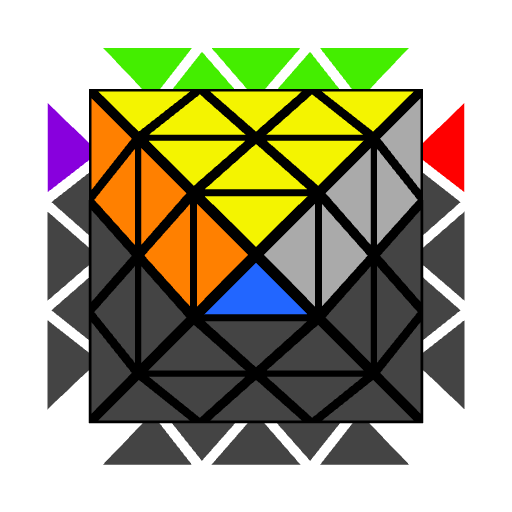
    
U

  

  

    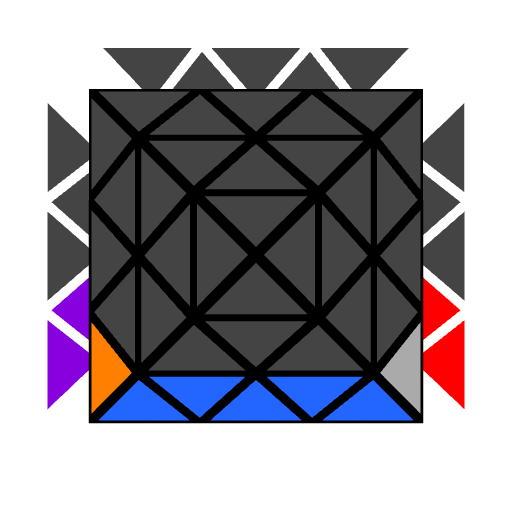
    
D

  

  

    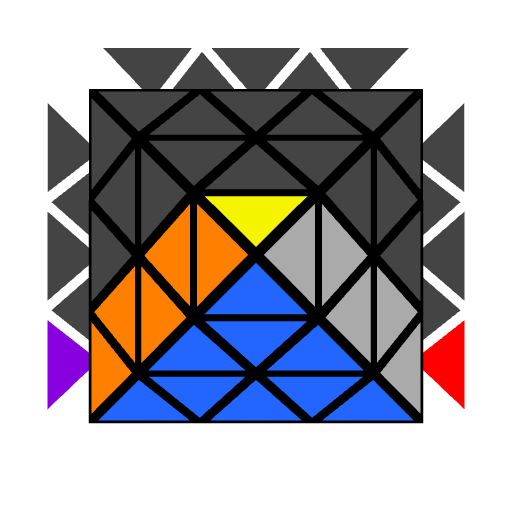
    
F

  

  

    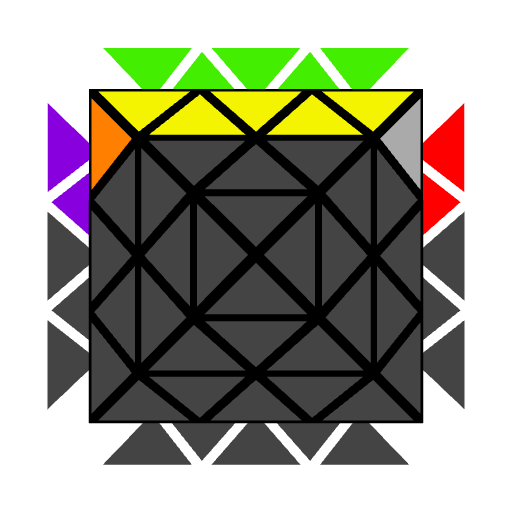
    
B

  

  

    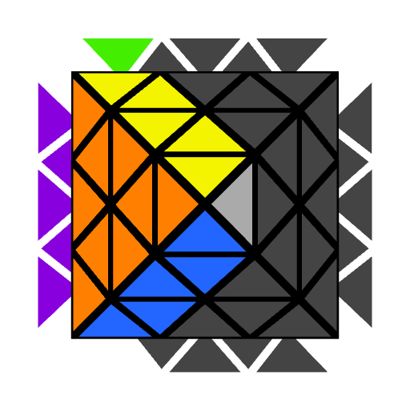
    
L

  

  

    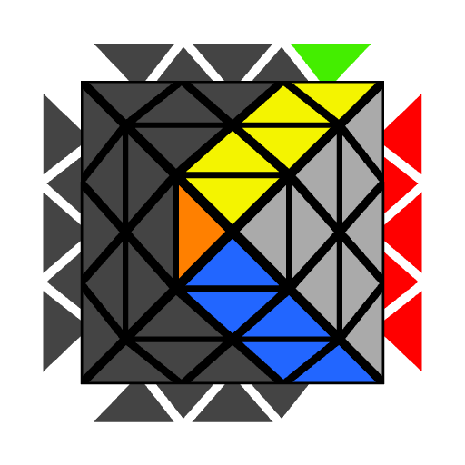
    
R

  

  

    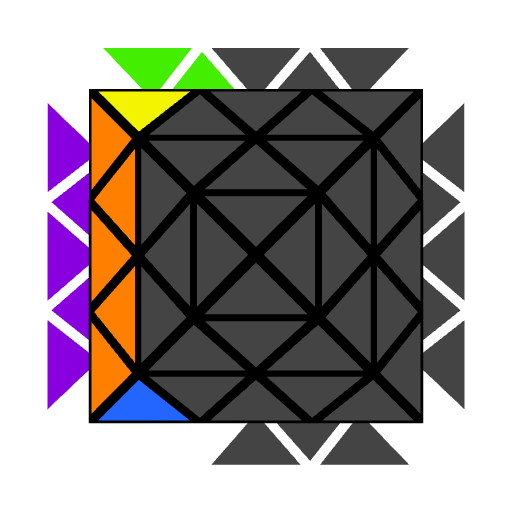
    
BL

  

  

    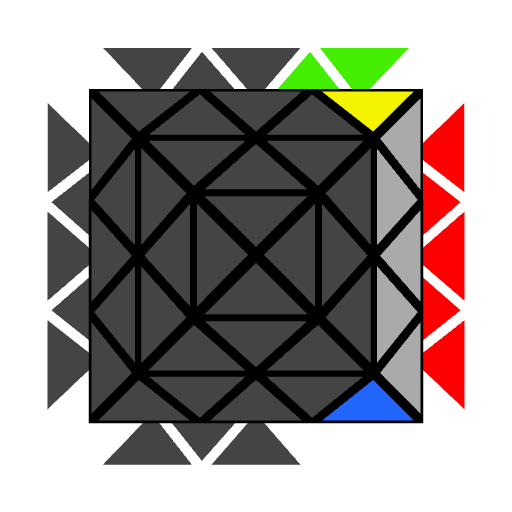
    
BR

  

  

    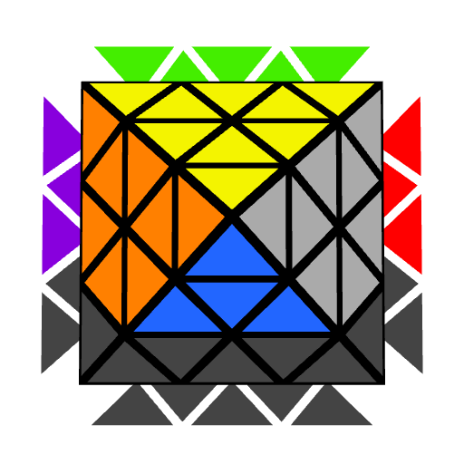
    
u

  

  

    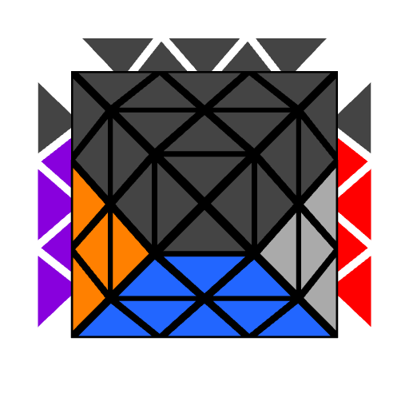
    
d

  

  

    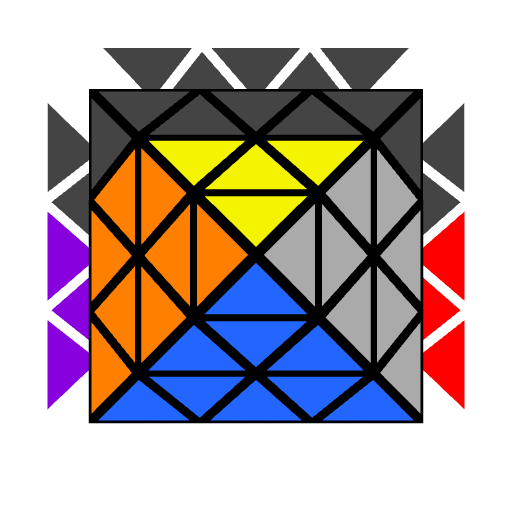
    
f

  

  

    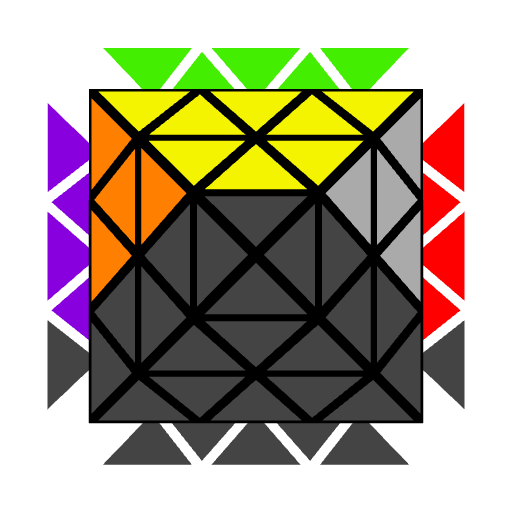
    
b

  

    

    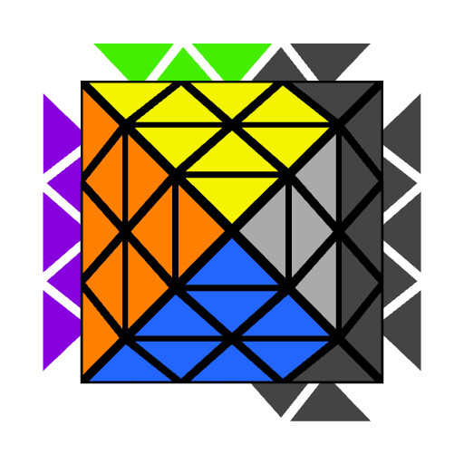
    
l

  

  

    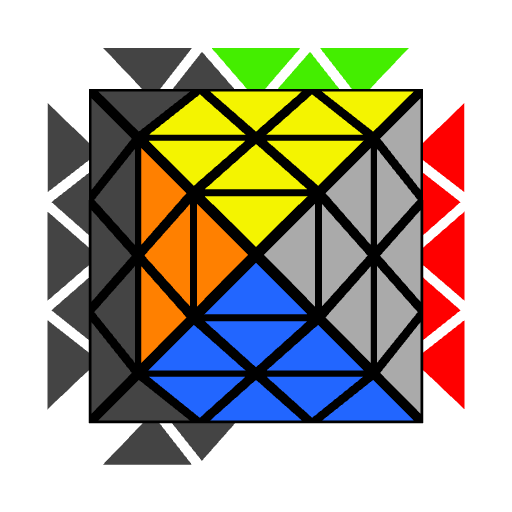
    
r

  

  

    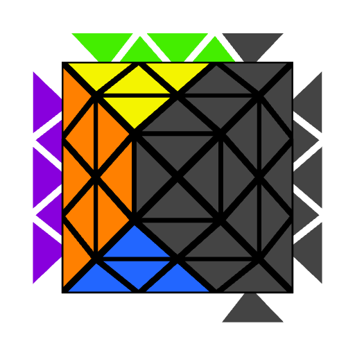
    
bl

  

  

    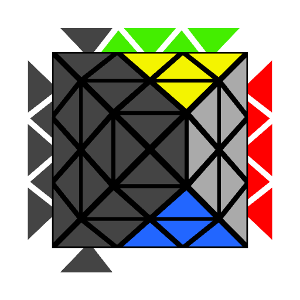
    
br

  

  

    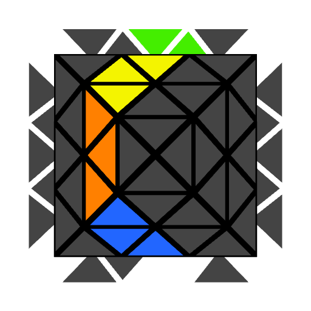
    
M

  

  

    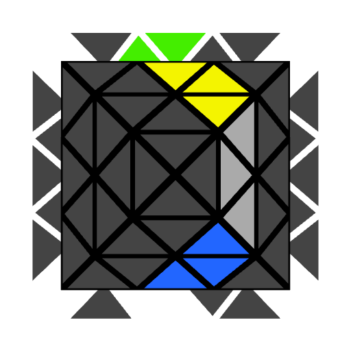
    
N

  

  

    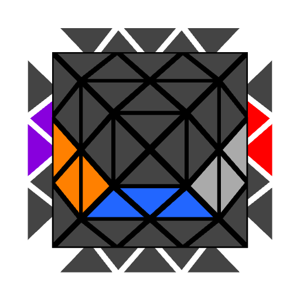
    
E

  

  

    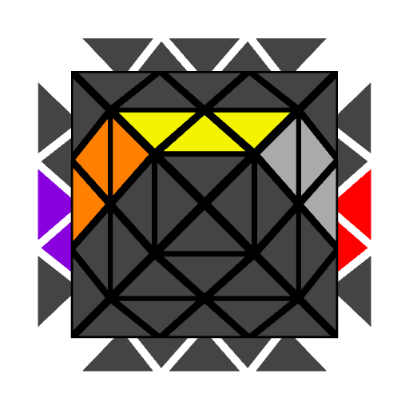
    
S

  

## Edge in Front Notation

  

    
    
U

  

  

    
    
D

  

  

    
    
F

  

  

    
    
B

  

  

    
    
L

  

  

    
    
R

  

  

    
    
BL

  

  

    
    
BR

  

  

    
    
u

  

  

    
    
d

  

  

    
    
f

  

  

    
    
b

  

    

    
    
l

  

  

    
    
r

  

  

    
    
bl

  

  

    
    
br

  

  

    
    
M

  

  

    
    
N

  

  

    
    
E

  

  

    
    
S

  

## Rotations

Rotations are notated by specifying the two layers that should be moved to the upper layer and the front layer. The two layers are placed in curly braces. The first letter is the layer that will be moved to the upper layer and the second letter is the layer that will become the front layer. For example, {R, D} indicates that the R layer should be on the upper layer and the D layer should be on the front.

  

    
    
{U, R}

  

  

    
    
U+R become U+F

  

  

    
    
{R, D}

  

  

    
    
R+D become U+F

  

An alternate notation that I once proposed in the FTO server is an adaption of the standard 3x3 x y z rotations. Just as on 3x3, rotations simply rotate through the various faces.

**CIF hold:**

* x rotates through the U, F, D, and B faces being on the U layer. The notation is x, x', and x2 - the same as on 3x3.
* y rotates through the F, R, BR, B, BL, and L faces being on the F layer. The notation is y, y2, y3, y', y2', and the optional y3'.
* z rotates through the U, L, F, and R faces being on the U layer. The notation is z, z', and z2 - the same as on 3x3.

**EIF hold:**

* x rotates through the U, F, D, and B faces being on the U layer. The notation is x, x', and x2 - the same as on 3x3.
* y rotates through the F, R, BR, B, BL, and L faces being on the F layer. The notation is y, y2, y3, y', y2', and the optional y3'.
* z rotates through the U, L, and R faces being on the U layer. The notation is z or z'.

This may be easier for new FTO solvers to learn due to many people having familiarity with 3x3 notation, it doesn't require the addition of new symbols such as "{}" or ",", and is quicker to execute because x, y, and z are memorized movements as opposed to {X, Y} requiring the user to think about specific faces that need to move to the indicated locations.