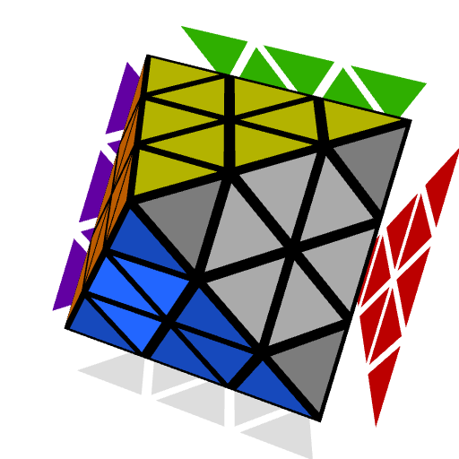

# Last Triple

Solve the last triple of the first two layers. Two approaches are provided, one is intuitive and the other is algorithmic. The intuitive version is great for new users who want to start solving immediately. Then once comfortable with the intuitive version, the algorithmic version provides a lower move count and higher TPS due to the speed optimal solutions.

    <twisty-player
        puzzle="fto"
        experimental-stickering-mask-orbits="C4RNER:IDIDI-,CENTERS:DI-IIDDDDDDDDDIIIDDDDDD-,EDGES:DDDDDDDDDDDD"
        experimental-setup-alg="LBLv"
        experimental-setup-anchor="end"
        background="none"
        control-panel="none"
        style="max-width: 300px; height: 300px;"
    ></twisty-player>

From this point onward, use an edge in front (EIF) hold. This means to slightly rotate to move the R layer to the front. The proper typical grip is to have your left thumb on the left half of the blue center and your right thumb on the grey center, as shown in the highlighted positions on the image below. For some algorithms you will want to move your right thumb to the bottom or back center at the start or partway through. Check the Notation page Edge in Front and Rotations sections to learn more.

{style="display: block; margin: 0 auto; width: 300px;"}

## Intuitive Last Triple

The last triple can also be solved completely intuitively by following a process similar to 3x3 F2L corner and edge pairing.

### First Triangle

Before starting, try using any combination of R U R', R U' R', L' U' L, and L' U L. Notice that it works just like the last slot on 3x3. Each of them move around the bottom triple and three U layer triples. The big U layer center stays in place. These simple motions are used to solve the bottom triple.

Start by finding the corner that belongs on the bottom layer. Check where its front layer color sticker is located. Then locate a triangle that is of that color. You want the triangle to be in the position where a single F or F' turn will correctly pair the corner with the triangle. Once the corner and triangle are in their positions to be paired, use the following process to solve the two pieces:

1. Turn the F layer to pair the corner with the triangle. In the below applet, F was used.
2. Move the pair to the correct side of the group of three center pieces that are now on the U layer. Use simple separation moves to move the pair - R U R', R U' R', L' U' L, or L' U L. In the below applet, R U' R' is used.
3. Move the pair and center group over to the F layer and solve. The bottom layer triangle will be solved next.

   

    <twisty-player
        id="fto-player-1"
        puzzle="fto"
        experimental-stickering-mask-orbits="C4RNER:I-I-I-,CENTERS:-I-II---------III------I,EDGES:------------"
        experimental-setup-alg="LBLv R U' BR U BR' R'"
        alg="R . // Attach corner to the triangle
BR U' BR' . // Attach the corner and triangle pair to the half center
U R' // Solve the pair and half center group"
        camera-longitude="60"
        background="none"
        style="max-width: 300px; height: 400px; margin-top: -30px;"
    ></twisty-player>

    <twisty-alg-viewer id="fto-alg-viewer-1" for="fto-player-1"></twisty-alg-viewer>
  

If the corner is already paired with a correct triangle before starting, solve the pair in the F2L using one of the separation moves.

  

    <twisty-player
        id="fto-player-2"
        puzzle="fto"
        experimental-stickering-mask-orbits="C4RNER:I-I-I-,CENTERS:-I-II---------III------I,EDGES:------------"
        experimental-setup-alg="LBLv BR U BR'"
        alg="BR U' BR' . // Solve preformed pair with triangle to the right of the corner"
        camera-longitude="60"
        background="none"
        style="max-width: 300px; height: 500px;"
    ></twisty-player>

    <twisty-alg-viewer id="fto-alg-viewer-2" for="fto-player-2"></twisty-alg-viewer>
  

  

    <twisty-player
        id="fto-player-3"
        puzzle="fto"
        experimental-stickering-mask-orbits="C4RNER:I-I-I-,CENTERS:-I-II---------III------I,EDGES:------------"
        experimental-setup-alg="LBLv F' U' F"
        alg="F' U F . // Solve preformed pair with triangle to the left of the corner"
        camera-longitude="60"
        background="none"
        style="max-width: 300px; height: 500px;"
    ></twisty-player>

    <twisty-alg-viewer id="fto-alg-viewer-3" for="fto-player-3"></twisty-alg-viewer>
  

If a triangle isn't in pairing position at the start of the step, position a triangle using R U R', R U' R', L' U' L, or L' U L. To keep the corner on the upper layer and in its current orientation, if the corner is at the upper front, use L' U L, L' U' L, R U R' U', or U R U' R'. If the corner is at the upper back right, use U' L' U L, L' U' L U, R U R', or R U' R'.

### Second Triangle

To solve the bottom layer triangle, use the following process:

1. Locate the bottom layer triangle that is currently on the upper layer.
2. Turn the front layer to move the solved first two layer pieces out of the way.
3. Use the same moves as before to place the bottom layer triangle. These moves are R U R', R U' R', L' U' L, or L' U L.
4. Reposition and solve the front layer pieces.

All six possibilities are provided below. These shouldn't be memorized and you only need to understand the first two because for the others you can simply turn the upper layer to move the triangle into one of those two positions. However, it is useful to know how to solve each of the others.

  

    <twisty-player
        id="fto-player-4"
        puzzle="fto"
        experimental-stickering-mask-orbits="C4RNER:I-I-I-,CENTERS:-I-II---------III-------,EDGES:------------"
        experimental-setup-alg="LBLv R U BR U' BR' R'"
        alg="R . // Move the front layer pieces out of the way
        BR U BR' . // Solve the bottom layer triangle
        U' R' // Reposition the front layer pieces"
        camera-longitude="60"
        background="none"
        style="max-width: 300px; height: 500px;"
    ></twisty-player>

    <twisty-alg-viewer id="fto-alg-viewer-4" for="fto-player-4"></twisty-alg-viewer>
  

  

    <twisty-player
        id="fto-player-5"
        puzzle="fto"
        experimental-stickering-mask-orbits="C4RNER:I-I-I-,CENTERS:-I-II---------III-------,EDGES:------------"
        experimental-setup-alg="LBLv R' U' F' U F R"
        alg="R' . // Move the front layer pieces out of the way
        F' U' F . // Solve the bottom layer triangle
        U R // Reposition the front layer pieces"
        camera-longitude="60"
        background="none"
        style="max-width: 300px; height: 500px;"
    ></twisty-player>

    <twisty-alg-viewer id="fto-alg-viewer-5" for="fto-player-5"></twisty-alg-viewer>
  

  

    <twisty-player
        id="fto-player-6"
        puzzle="fto"
        experimental-stickering-mask-orbits="C4RNER:I-I-I-,CENTERS:-I-II---------III-------,EDGES:------------"
        experimental-setup-alg="LBLv R BR U BR' U' R'"
        alg="R . // Move the front layer pieces out of the way
        U BR U' BR' . // Solve the bottom layer triangle
        R' // Reposition the front layer pieces"
        camera-longitude="60"
        background="none"
        style="max-width: 300px; height: 500px;"
    ></twisty-player>

    <twisty-alg-viewer id="fto-alg-viewer-6" for="fto-player-6"></twisty-alg-viewer>
  

  

    <twisty-player
        id="fto-player-7"
        puzzle="fto"
        experimental-stickering-mask-orbits="C4RNER:I-I-I-,CENTERS:-I-II---------III-------,EDGES:------------"
        experimental-setup-alg="LBLv R' F' U' F U R"
        alg="R' . // Move the front layer pieces out of the way
        U' F' U F . // Solve the bottom layer triangle
        R // Reposition the front layer pieces"
        camera-longitude="60"
        background="none"
        style="max-width: 300px; height: 500px;"
    ></twisty-player>
    <twisty-alg-viewer id="fto-alg-viewer-7" for="fto-player-7"></twisty-alg-viewer>
  

  

    <twisty-player
        id="fto-player-8"
        puzzle="fto"
        experimental-stickering-mask-orbits="C4RNER:I-I-I-,CENTERS:-I-II---------III-------,EDGES:------------"
        experimental-setup-alg="LBLv R' U' BR U' BR' U' R"
        alg="R' . // Move the front layer pieces out of the way
        U BR U BR' . // Solve the bottom layer triangle
        U R // Reposition the front layer pieces"
        camera-longitude="60"
        background="none"
        style="max-width: 300px; height: 500px;"
    ></twisty-player>

    <twisty-alg-viewer id="fto-alg-viewer-8" for="fto-player-8"></twisty-alg-viewer>
  

  

    <twisty-player
        id="fto-player-9"
        puzzle="fto"
        experimental-stickering-mask-orbits="C4RNER:I-I-I-,CENTERS:-I-II---------III-------,EDGES:------------"
        experimental-setup-alg="LBLv R U F' U F U R'"
        alg="R . // Move the front layer pieces out of the way
        U' F' U' F . // Solve the bottom layer triangle
        U' R' // Reposition the front layer pieces"
        camera-longitude="60"
        background="none"
        style="max-width: 300px; height: 500px;"
    ></twisty-player>

    <twisty-alg-viewer id="fto-alg-viewer-9" for="fto-player-9"></twisty-alg-viewer>
  

### Simultaneous Triangle Solving

Solving the two triangles can be a merged process. Solving the bottom layer triangle always starts with an F or F' move in the basic version described above. This provides the opportunity to solve the bottom layer triangle just before the end of the right side layer triangle solving step.

In the example applet below, the corner is first attached to the front layer triangle, then grouped with the three center pieces. Instead of then aligning this group of pieces to the front layer and solving, the bottom layer triangle is solved first.

   

    <twisty-player
        id="fto-player-10"
        puzzle="fto"
        experimental-stickering-mask-orbits="C4RNER:I-I-I-,CENTERS:-I-II---------III-------,EDGES:------------"
        experimental-setup-alg="LBLv R' U' BR U' BR' F' U' F R"
        alg="R' . // Attach corner to the triangle
        F' U F . // Attach the corner and triangle pair to the half center
        BR U BR' . // Solve the bottom layer triangle
        U R // Solve the pair and half center group"
        camera-longitude="60"
        background="none"
        style="max-width: 300px; height: 500px;"
    ></twisty-player>

    <twisty-alg-viewer id="fto-alg-viewer-10" for="fto-player-10"></twisty-alg-viewer>
  

## Algorithmic Last Triple

### Part 1: Corner

The first part of solving the last triple is to place the corner. This is a simple insert using either R U' R' or L' U L. Check the orientation of the corner then insert using the appropriate algorithm. If the corner is in its correct location but misoriented, use either of the two algorithms to bring it to the upper layer, then correctly solve the corner.

  

    <twisty-player
        id="fto-player-11"
        puzzle="fto"
        experimental-stickering-mask-orbits="C4RNER:I-I-I-,CENTERS:-IIII---------III------I,EDGES:------------"
        experimental-setup-alg="LBLv U' BR U BR'"
        alg="BR U' BR'"
        camera-longitude="60"
        background="none"
        style="max-width: 300px; height: 500px;"
    ></twisty-player>
    <twisty-alg-viewer id="fto-alg-viewer-11" for="fto-player-11"></twisty-alg-viewer>
  

  

    <twisty-player
        id="fto-player-12"
        puzzle="fto"
        experimental-stickering-mask-orbits="C4RNER:I-I-I-,CENTERS:-IIII---------III------I,EDGES:------------"
        experimental-setup-alg="LBLv U F' U' F"
        alg="F' U F"
        camera-longitude="60"
        background="none"
        style="max-width: 300px; height: 500px;"
    ></twisty-player>

    <twisty-alg-viewer id="fto-alg-viewer-12" for="fto-player-12"></twisty-alg-viewer>
  

### Part 2: Front Triangle

Next, the front layer triangle will be solved. There are three to choose from so they will be easy to spot. There will always be at least two on the upper layer, so locate one and use one of the following algorithms to place it. Use the correct algorithm depending on if the triangle is to the left or right of an edge on the upper layer.

  

    <twisty-player
        id="fto-player-13"
        puzzle="fto"
        experimental-stickering-mask-orbits="C4RNER:I-I-I-,CENTERS:-I-II---------III------I,EDGES:------------"
        experimental-setup-alg="LBLv R BR' br U BR U' br' R'"
        alg="R br U BR' U' br' BR R'"
        camera-longitude="60"
        background="none"
        style="max-width: 300px; height: 500px;"
    ></twisty-player>
    <twisty-alg-viewer id="fto-alg-viewer-13" for="fto-player-13"></twisty-alg-viewer>
  

  

    <twisty-player
        id="fto-player-14"
        puzzle="fto"
        experimental-stickering-mask-orbits="C4RNER:I-I-I-,CENTERS:-I-II---------III------I,EDGES:------------"
        experimental-setup-alg="LBLv BR br' U' BR U BR' br U' BR' U'"
        alg="(U) BR U br' BR U' BR' U br BR'"
        camera-longitude="60"
        background="none"
        style="max-width: 300px; height: 500px;"
    ></twisty-player>

    <twisty-alg-viewer id="fto-alg-viewer-14" for="fto-player-14"></twisty-alg-viewer>
  

### Part 3: Bottom Triangle

The last step to solving the triple is to solve the bottom triangle. This involves using three simple algorithms that move the corner and front layer triangle that was just solved out of the way, place the triangle, then restore the front layer.

  

    <twisty-player
        id="fto-player-15"
        puzzle="fto"
        experimental-stickering-mask-orbits="C4RNER:I-I-I-,CENTERS:-I-II---------III-------,EDGES:------------"
        experimental-setup-alg="LBLv R U BR U' BR' R' U"
        alg="U' R BR U BR' U' R'"
        camera-longitude="60"
        background="none"
        style="max-width: 300px; height: 500px;"
    ></twisty-player>

    <twisty-alg-viewer id="fto-alg-viewer-15" for="fto-player-15"></twisty-alg-viewer>
  

  

    <twisty-player
        id="fto-player-16"
        puzzle="fto"
        experimental-stickering-mask-orbits="C4RNER:I-I-I-,CENTERS:-I-II---------III-------,EDGES:------------"
        experimental-setup-alg="LBLv R BR U BR' U' R'"
        alg="R U BR U' BR' R'"
        camera-longitude="60"
        background="none"
        style="max-width: 300px; height: 500px;"
    ></twisty-player>

    <twisty-alg-viewer id="fto-alg-viewer-16" for="fto-player-16"></twisty-alg-viewer>
  

  

    <twisty-player
        id="fto-player-17"
        puzzle="fto"
        experimental-stickering-mask-orbits="C4RNER:I-I-I-,CENTERS:-I-II---------III-------,EDGES:------------"
        experimental-setup-alg="LBLv R br BR' U BR U' br' R'"
        alg="R br U BR' U' BR br' R'"
        camera-longitude="60"
        background="none"
        style="max-width: 300px; height: 500px;"
    ></twisty-player>

    <twisty-alg-viewer id="fto-alg-viewer-17" for="fto-player-17"></twisty-alg-viewer>
  

## Intermediate Solving

Once accustomed to the starter steps, the first two parts of solving the triple can be combined. The corner and front layer triangle can be simultaneously solved using one of 23 algorithms. Then solve the bottom triangle using a simple solutions above. Go to the document below for the complete algorithm list.

    <a href="https://docs.google.com/spreadsheets/d/1NSa4MMV10ma4nNJKRfET_M1OwxULN_oSWUkThwLcTh0/edit?gid=323120253#gid=323120253" class="custom-styled-link" target="_blank" rel="noopener noreferrer">Malte Ihlefeld's Last Triple Algorithms</a>

## One Look Triple

The most advanced version of solving the triple is to solve the three pieces all at once. The full set can be learned from the following algorithm documents.

    <a href="https://docs.google.com/spreadsheets/d/1NSa4MMV10ma4nNJKRfET_M1OwxULN_oSWUkThwLcTh0/edit?gid=323120253#gid=323120253" class="custom-styled-link" target="_blank" rel="noopener noreferrer">Malte Ihlefeld's Last Triple Algorithms</a>

    <a href="https://docs.google.com/spreadsheets/d/1gJHxSOoP-m6AlGgdPDzme0Hw4mS2RvJJ76D6OKiNOyA/edit?gid=1108390574#gid=1108390574" class="custom-styled-link" target="_blank" rel="noopener noreferrer">Liam Highducheck's Last Triple Algorithms</a>

## Avoiding Corner in Slot

To reduce the number of cases for the last triple, it can be ensured that the corner isn't placed in its slot before arriving at the step. At the end of solving the centers, solve the centers in a slightly different way to keep the last triple corner on the upper layer. If the corner is attached to the end of the half center and would be placed in slot with the R U' R' or R U R' ending, the corner can be moved out of the way. Below are the two main alternate endings to prevent the corner from being placed in its slot.

  

    <twisty-player
        id="fto-player-18"
        puzzle="fto"
        experimental-stickering-mask-orbits="C4RNER:I-I-I-,CENTERS:-IIII-I-I-----IIII-----I,EDGES:-I-I-I------"
        experimental-setup-alg="LBLv R U R'"
        alg="R F' U' F R'"
        background="none"
        style="max-width: 300px; height: 400px; margin-top: -30px;"
    ></twisty-player>
    <twisty-alg-viewer id="fto-alg-viewer-18" for="fto-player-18"></twisty-alg-viewer>
  

  

    <twisty-player
        id="fto-player-19"
        puzzle="fto"
        experimental-stickering-mask-orbits="C4RNER:I-I-I-,CENTERS:-IIII-I-I-----IIII-----I,EDGES:-I-I-I------"
        experimental-setup-alg="LBLv R U' R'"
        alg="R BR U BR' R'"
        background="none"
        style="max-width: 300px; height: 400px; margin-top: -30px;"
    ></twisty-player>

    <twisty-alg-viewer id="fto-alg-viewer-19" for="fto-player-19"></twisty-alg-viewer>
  

